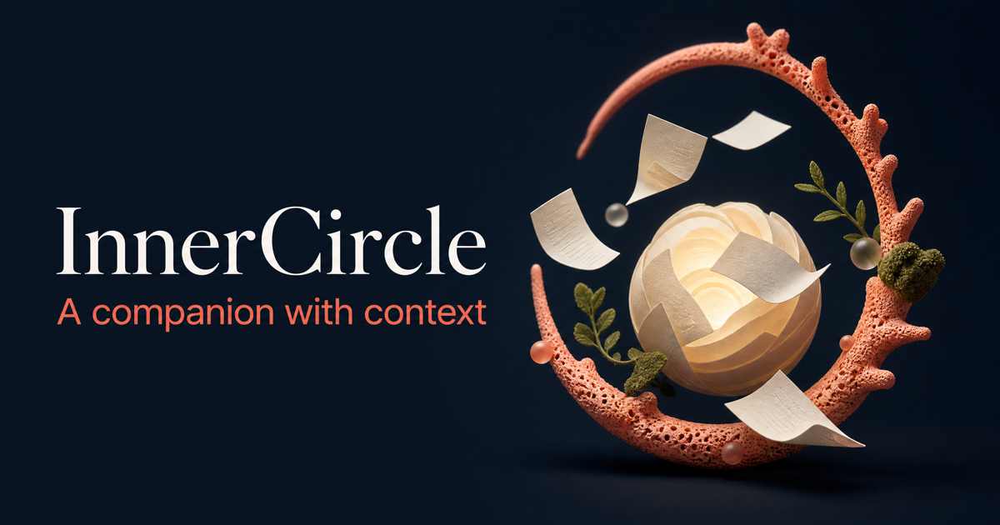

<p align="center">
  
</p>

<h1 align="center">InnerCircle</h1>

<p align="center">
  <strong>Your AI-powered support network. Mom, Best Friend, Girlfriend, Big Sister, all in one app.</strong>
</p>

<p align="center">
  <a href="#-features"></a>
  <a href="#-how-it-works"></a>
  <a href="#-tech-stack"></a>
  <a href="#-project-structure"></a>
  <a href="#-quick-start"></a>
  <a href="#-api-documentation"></a>
  <a href="#-deployment"></a>
  <a href="#-contributing"></a>
</p>

<p align="center">
  
  
  
  
  
</p>

---

## What is InnerCircle?

**InnerCircle** is a multi-persona AI companion platform designed to give users a genuine emotional support network. Instead of chatting with a single generic bot, users talk to distinct AI personalities. Each one has its own tone, communication style, behavior patterns, and long-term memory.

The app is built to feel alive. Every screen has thoughtful animations, haptic feedback, and visual polish that reinforces the feeling that someone is actually there with you. It is not a utility. It is a relationship app.

### Available Personas

| Persona            | Personality                                                |
| ------------------ | ---------------------------------------------------------- |
| **Mom**            | Nurturing, gentle, and offers thoughtful life advice       |
| **Best Friend**    | Energetic, encouraging, and non-judgmental                 |
| **Girlfriend**     | Affectionate, romantic, and proactive with daily check-ins |
| **Big Sister**     | Protective, honest, and playful                            |

Users can also create their own custom personas with a specific relationship type, personality description, and avatar emoji. Premium personas can be configured with unrestricted content for more natural adult conversations.

Built with **Flutter** for mobile, **Spring Boot** for backend services, **PostgreSQL + pgvector** for memory storage, and **Groq (Llama 3 70B)** for fast conversational AI.

---

## Features

### Core Features

* **Persistent Memory**
  Each persona remembers important facts shared by the user. Memories are stored using pgvector embeddings and retrieved contextually during conversations. Users can view, search, and delete memories from the Memories screen.

* **Real-Time Chat**
  AI responses are generated quickly using Groq's inference engine. Messages appear with smooth slide-in animations and visual feedback. The chat supports message regeneration, copying, sharing, and emoji reactions.

* **Custom Personas**
  Users can create their own companions by choosing a relationship type, writing a personality description, and picking an avatar. The app uses a stepped flow with live preview to make creation feel tangible. Custom personas can be marked as unrestricted for NSFW content.

* **Suggested Follow-ups**
  After each assistant response, the app suggests contextual follow-up messages based on the conversation. Tapping a suggestion populates the input field so the user can edit or send it directly.

* **Message Actions**
  Tap any assistant message to reveal a bottom sheet with options to copy the text, regenerate the response, or share it. The regenerate feature re-runs the AI with the full conversation context for a fresh take.

* **Message Reactions**
  Long-press any message to add an emoji reaction. The reaction picker appears with a staggered spring animation, and the selected reaction lands with a satisfying scale bounce.

* **Timestamps**
  Every message displays a timestamp below the bubble. Today's messages show just the time. Yesterday shows "Yesterday" with the time. Older messages include the date as well.

* **Proactive Notifications**
  Personas can check in on you at scheduled times. Users can schedule recurring reminders with specific times and days, and toggle them on or off.

* **Freemium Subscription**
  * Free tier: all built-in personas with locked premium cards and 50 messages per day
  * Premium tier: all personas unlocked, unlimited messages, priority response speed, and ability to create unlimited custom personas

* **Dark Mode**
  Full dark mode support across every screen. The transition between light and dark uses a smooth crossfade instead of an instant swap.

* **Chat Preferences**
  Users can customize their experience from the Settings screen. Set a preferred name that personas use when talking to you, choose a communication style (casual, formal, playful, or direct), adjust response length, and toggle memory on or off.

### Design and Motion

* **Motion Design System**
  A consistent timing and easing system built into the app. Micro interactions use 150ms, card entrances use 320ms, and big moments like the splash or upgrade celebration use 700ms. Every animation respects the OS-level reduced-motion setting.

* **Haptic Feedback**
  A small, consistent vocabulary of haptics: selection clicks for pickers and scrolling, light impacts for sending messages and toggling switches, and medium impacts for completing actions like reactions or upgrades.

* **Shimmer Loading**
  Every loading state uses shaped shimmer placeholders instead of bare spinners. The persona list shows card-shaped shimmers, the chat shows alternating left-right message bubble shimmers, and memories show card shimmers.

* **Staggered Entrances**
  Lists do not just appear all at once. Persona cards, memory cards, and notification cards fade and slide up one by one with a small delay between each, making the content feel like it is arriving rather than just existing.

* **Smooth Page Transitions**
  Every navigation uses fade and slide transitions instead of instant page swaps. The chat screen slides in gently from the right, profile settings fade in with a slight upward movement, and the logout animation smoothly transitions back to the login screen with a scale and fade effect.

### Screen by Screen

* **Splash Screen**
  The logo bounces in with an elastic spring animation while the background gradient shifts through the brand colors. The subtitle slides up after the logo lands. The splash appears for at least 2 seconds on every app launch, giving the app a polished feel every time you open it.

* **Onboarding**
  First-time users see four animated screens that introduce the app's core value. Each page has its own persona color, an animated icon, and a staggered text reveal. Users can skip or swipe through, and progress dots at the bottom show where they are in the flow.

* **Login and Register**
  The logo scales in with a spring, then the title, fields, and button each slide up with increasing delay. On invalid input, the entire form shakes horizontally with a heavy haptic, clearly communicating "no" without being harsh. Registration now collects your display name and date of birth upfront so personas can personalize responses from the start.

* **Home Screen**
  Persona cards stagger in from bottom to top. Pressing a card gives it a subtle scale-down plus a glow pulse in that persona's gradient color with haptic feedback. The greeting header shows a time-of-day message with your name highlighted in the brand color. The create-persona FAB morphs from a plus to an X when tapped. Pull to refresh reloads everything.

* **Chat Screen**
  The persona avatar in the appbar has a subtle breathing animation and shows "typing..." or "online" status. New messages slide in from the side with a spring overshoot. Assistant messages show the persona's name above the bubble in their signature color. The typing indicator has three bouncing dots with a soft persona-colored glow behind them. After each response, contextual suggestion chips appear below the message. The reaction picker opens with each emoji scaling in one after another. A small FAB appears when you scroll up, letting you jump back to the bottom. The entire chat background has a very low-opacity tint of the current persona's color. The input field shows "Message [PersonaName]..." as placeholder text.

* **Upgrade Screen**
  A full-screen modal with an animated gradient that slowly rotates through all four persona colors. Free and premium comparison cards sit side by side, and the premium checkmarks animate in one at a time. The CTA button has a continuous shimmer sweep. On successful upgrade, a celebratory checkmark draws in with a scale animation.

* **Create Persona**
  A four-step flow (Name, Relationship, Personality, Avatar) with progress dots at the top. Each step slides in horizontally. The emoji picker has a spring scale on selection, and a live preview bubble updates as you type. The personality step includes an NSFW toggle for unrestricted content on custom personas.

* **Memories Screen**
  Cards fade and slide up with staggered timing. Swipe left to delete with a red reveal. The loading state uses a shaped shimmer placeholder.

* **Profile Screen**
  The avatar bounces on tap with a three-stage scale animation. Navigation rows have a chevron that nudges right on press. The upgrade button opens the full-screen Upgrade modal. Account details show your display name, email, date of birth, language, and timezone.

* **Notifications Screen**
  Each scheduled card uses a custom animated toggle with a smooth thumb slide and color morph. Cards stagger in on load.

* **Settings Screen**
  The dark mode toggle uses an animated icon switcher that crossfades between sun and moon icons. Section headers have icons and bolder typography for better visual hierarchy. Chat preferences let you control how personas communicate with you.

---

## How It Works

```text
User signs up (with name and date of birth)
        |
        v
Spring Security issues JWT + subscription tier
        |
        v
Onboarding screens introduce the app (first launch only)
        |
        v
Splash screen plays for 2 seconds
        |
        v
User selects a persona
        |
        v
Persona prompt + user memories are loaded
        |
        v
User sends message
        |
        v
Backend retrieves relevant memories using pgvector
        |
        v
Groq (Llama 3 70B) generates a response
        |
        v
Suggested follow-ups are generated for quick replies
        |
        v
Important facts are extracted and stored as memories
        |
        v
Scheduler checks notification queue
        |
        v
FCM push notifications are delivered
```

---

## Tech Stack

| Layer                        | Technology                                               |
| ---------------------------- | -------------------------------------------------------- |
| **Mobile**                   | Flutter, Material Design 3                               |
| **Backend**                  | Java 17, Spring Boot 4.1, Spring Security, Spring Data JPA |
| **Database**                 | PostgreSQL 18 + pgvector                                 |
| **LLM Provider**             | Groq Cloud (Llama 3 70B)                                 |
| **Authentication**           | JWT with subscription tier in token                      |
| **Admin Dashboard**          | React + Vite                                             |
| **Push Notifications**       | Firebase Cloud Messaging (FCM)                           |
| **Hosting**                  | Render, Fly.io                                           |
| **Managed Database Options** | Supabase, AWS RDS                                        |

---

## Project Structure

```text
innercircle/
├── backend/                          # Spring Boot 4.1 API
│   ├── src/main/java/com/innercircle/
│   │   ├── config/                   # Security, JWT, CORS, WebClient
│   │   ├── controller/               # REST endpoints (Auth, Chat, Memory, Notification, Persona, User, UserPreferences)
│   │   ├── dto/                      # Request/response objects (AuthRequest with displayName + dateOfBirth, RegenerateRequest, etc.)
│   │   ├── exception/                # Custom exceptions + global handler
│   │   ├── model/                    # JPA entities (User, Persona, Message, Conversation, Memory, UserPreferences, etc.)
│   │   ├── repository/               # Spring Data JPA repos
│   │   ├── service/                  # Business logic (Chat, Auth, Embedding, Notification, Persona, etc.)
│   │   └── util/                     # JwtUtil
│   ├── src/main/resources/
│   │   └── application.yml
│   └── pom.xml
│
├── database/                         # SQL schemas and migrations
│   ├── schema.sql
│   └── migration_*.sql
│
├── frontend/                         # Flutter (Dart) Android app
│   ├── lib/
│   │   ├── models/                   # Data classes (User, Persona, ChatMessage, Memory, UserPreferences, etc.)
│   │   ├── screens/                  # UI screens (Home, Chat, Login, Register, Profile, Settings, Onboarding, etc.)
│   │   ├── services/                 # API client, auth, chat, preferences, push notifications, haptics
│   │   ├── theme/                    # Colors, typography, motion design tokens
│   │   └── widgets/                  # Shared widgets, splash screen, persona avatar
│   ├── android/                      # Android-specific config (Gradle, manifest, Firebase)
│   └── pubspec.yaml
│
├── .github/workflows/ci.yml         # GitHub Actions CI (backend tests, frontend analyze)
└── README.md
```

---

# Quick Start

## Prerequisites

* Java 17+
* Maven 3.8+
* Flutter 3.16+
* PostgreSQL 14+ with pgvector
* Groq API Key

Obtain a free API key from:

```text
https://console.groq.com
```

---

## 1. Clone the Repository

```bash
git clone https://github.com/rajit2004/InnerCircle.git
cd InnerCircle
```

---

## 2. Set Up PostgreSQL

Create a database:

```sql
CREATE DATABASE innercircle;
```

Enable the pgvector extension:

```sql
CREATE EXTENSION IF NOT EXISTS vector;
```

Run the schema:

```bash
psql -d innercircle -f database/schema.sql
```

---

## 3. Configure the Backend

```bash
cd backend

cp src/main/resources/application.yml.example \
   src/main/resources/application.yml
```

Update the following values inside `application.yml`:

* Database URL
* Database username and password
* JWT secret
* Groq API key
* Firebase credentials (optional, for push notifications)

---

## 4. Run the Backend

```bash
./mvnw spring-boot:run
```

Backend server starts at:

```text
http://localhost:8080
```

---

## 5. Run the Admin Dashboard (Optional)

```bash
cd admin

npm install
npm run dev
```

Dashboard URL:

```text
http://localhost:5173
```

Use the admin key configured in `application.yml`.

---

## 6. Run the Flutter App

```bash
cd frontend

flutter pub get
flutter run
```

### Android Emulator

Use `10.0.2.2` instead of `localhost`.

For physical devices, use your machine's local network IP address. You can pass it as a build argument:

```bash
flutter run --dart-define=BASE_URL=http://192.168.1.100:8080
```

---

# API Documentation

All endpoints are prefixed with:

```text
/api
```

---

## Authentication

### Register

```http
POST /api/auth/register
```

**Request Body**

```json
{
  "email": "user@example.com",
  "password": "secret",
  "displayName": "Alex",
  "dateOfBirth": "1998-05-15"
}
```

The `displayName` and `dateOfBirth` fields are optional but recommended. They help personas personalize responses from the start.

---

### Login

```http
POST /api/auth/login
```

**Request Body**

```json
{
  "email": "user@example.com",
  "password": "secret"
}
```

**Response**

```json
{
  "token": "jwt_token",
  "email": "user@example.com",
  "role": "USER",
  "subscriptionTier": "free"
}
```

---

## Personas

### List Personas

```http
GET /api/personas
```

Returns all personas the current user has access to. Free users see premium personas with a lock overlay. Premium users see all of them unlocked.

---

### Create Custom Persona

```http
POST /api/personas
```

**Request Body**

```json
{
  "name": "Alex",
  "relationshipType": "FRIEND",
  "personalityDescription": "witty and a little sarcastic",
  "avatarEmoji": "😎",
  "nsfwEnabled": false
}
```

The `nsfwEnabled` field enables unrestricted content for the persona. It defaults to false.

---

### Delete Custom Persona

```http
DELETE /api/personas/{id}
```

Only custom personas created by the user can be deleted.

---

## Chat

### Send Message

```http
POST /api/chat
```

**Request Body**

```json
{
  "persona_id": "uuid",
  "content": "I'm stressed",
  "conversation_id": "optional"
}
```

**Response**

```json
{
  "reply": "Hey, talk to me. What's going on?",
  "conversationId": "uuid",
  "messageId": "uuid"
}
```

---

### Regenerate Message

```http
POST /api/chat/regenerate
```

**Request Body**

```json
{
  "conversationId": "uuid",
  "personaId": "uuid"
}
```

Deletes the last assistant message and generates a fresh response using the full conversation history.

---

### Get Chat History

```http
GET /api/chat/history/{personaId}
```

Returns the most recent conversation and its messages for a given persona.

---

### Set Message Reaction

```http
POST /api/chat/reactions
```

**Request Body**

```json
{
  "messageId": "uuid",
  "reaction": "heart"
}
```

---

### Delete Conversation

```http
DELETE /api/chat/conversation/{personaId}
```

Permanently deletes the conversation history with a specific persona.

---

## Memory

### Get User Memories

```http
GET /api/memories
```

Returns all memories the system has learned about the current user across all personas.

---

### Delete Memory

```http
DELETE /api/memories/{id}
```

Removes a specific memory. The persona will forget that fact.

---

## Notifications

### Register Device Token

```http
POST /api/notifications/register
```

```json
{
  "token": "fcm_token",
  "platform": "android"
}
```

---

### Schedule Check-in

```http
POST /api/notifications/schedule
```

```json
{
  "persona_id": "uuid",
  "scheduled_at": "08:00",
  "days_of_week": "1,2,3,4,5"
}
```

---

### List Scheduled Check-ins

```http
GET /api/notifications/scheduled
```

---

### Cancel Scheduled Check-in

```http
DELETE /api/notifications/schedule/{id}
```

---

## User Preferences

### Get Preferences

```http
GET /api/user-preferences
```

Returns the user's chat preferences including preferred name, communication style, response length, and memory toggle.

---

### Update Preferences

```http
PUT /api/user-preferences
```

**Request Body**

```json
{
  "preferredName": "Raj",
  "communicationStyle": "casual",
  "responseLength": "moderate",
  "memoryEnabled": true
}
```

---

## Subscription

### Update Subscription Tier

```http
POST /api/users/subscription
```

**Request Body**

```json
{
  "tier": "premium"
}
```

---

### Get User Profile

```http
GET /api/users/me
```

Returns the current user's profile including subscription tier, message usage, display name, date of birth, and account info.

---

### Update Profile

```http
PUT /api/users/me
```

**Request Body**

```json
{
  "displayName": "Ranesh",
  "dateOfBirth": "2002-03-15",
  "language": "en",
  "timezone": "UTC"
}
```

---

# Deployment

## Backend

Build production artifact:

```bash
./mvnw package
```

Run the generated JAR:

```bash
java -jar target/*.jar
```

Configure production environment variables through:

* `application.yml`
* Docker secrets
* OS environment variables

---

## Flutter Application

### Android

```bash
flutter build apk
flutter build appbundle
```

### iOS

```bash
flutter build ios
```

Upload builds to TestFlight before App Store release.

---

## Database Hosting Options

* Supabase
* AWS RDS
* Self-hosted PostgreSQL
* Managed cloud PostgreSQL providers

---

# Contributing

Contributions are welcome.

1. Fork the repository.
2. Create a feature branch.

```bash
git checkout -b feature/amazing-idea
```

3. Commit changes.

```bash
git commit -m "Add amazing feature"
```

4. Push branch.

```bash
git push origin feature/amazing-idea
```

5. Open a Pull Request.

Please review the project's Code of Conduct and Contributing Guidelines before contributing.

---

# License

Distributed under the **MIT License**.

---

# Acknowledgements

* **Groq** for ultra-fast LLM inference
* **Spring Boot** for a robust backend ecosystem
* **Flutter** for a powerful cross-platform mobile framework
* **Supabase** for PostgreSQL hosting and pgvector support

---

# Author

**Ranesh Rajit**
B.Tech Computer Science Student, India

[](https://github.com/rajit2004)

[](https://linkedin.com/in/ranesh-kun)
